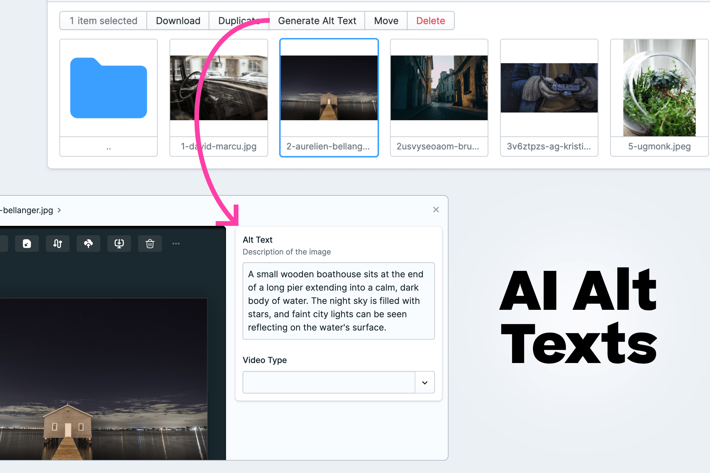

# Statamic AI Alt Generator

AI-powered alt text generation for Statamic assets using OpenAI's Vision API.



## Features

- Automatically generates alt text for images using OpenAI's Vision API
- Works with JPG, PNG, Webp and GIF files (SVG is not supported)
- Available in both list and detail views (Statamic 5+)
- Queued job processing to handle large batches

## Requirements

- Statamic 5.0+
- PHP 8.1+
- OpenAI API key
- Laravel Queue worker (for background processing)

## Installation

1. Install the package:
```bash
composer require croox/statamic-ai-alt
```

1. Add your OpenAI API key and the target lanuage to your `.env` file:

```env
# API Key 
OPENAI_API_KEY=<your-api-key-here>
# Set the language for alt text generation prompt.
OPENAI_ALT_LANGUAGE="English"
```

## Usage
1. In the Assets section of the Control Panel, select one or more images
2. Click the "Generate Alt Text" action
3. The alt text will be generated in the background and saved to your assets


## Future ideas / missing features
- Support SVG
- Check for existing alt text before overriding with API results

## License
[LICENSE](./LICENSE.txt)  
[](https://opensource.org/licenses/MIT)
